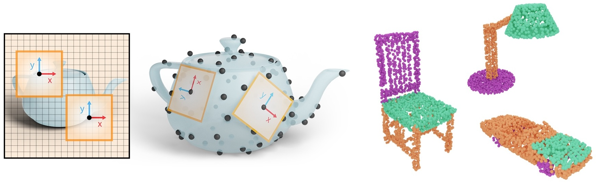

## SGP 2025 Graduate School
# Course: Deep Learning on Meshes and Point Clouds
[Ruben Wiersma](https://rubenwiersma.nl/) 
ETH Zurich

<a id="slides-link"
      class="icon" title="Slides" aria-label="Github Project"
      href="assets/pdf/deeplearning_meshes_pointclouds.pdf" target="_blank">
    <i class="fa fa-2x fa-file-pdf-o"></i> Slides</a>&nbsp;&nbsp;
<a id="video-link"
      class="icon" title="Recording" aria-label="PDF link"
      href="#" target="_blank">
    <i class="fa fa-2x fa-video"></i> Recording</a>&nbsp;&nbsp;
<a id="code-link"
      class="icon" title="DeltaConv supplement PDF" aria-label="PDF link"
      href="/assets/misc/sgp_dl_tutorial.zip" target="_blank">
    <i class="fa fa-2x fa-code"></i> Tutorial</a>

## Summary
Data-driven algorithms have proven valuable for many tasks, with high-profile success in image understanding and synthesis and language modelling. In this course, we look at how such algorithms can be used for data on curved surfaces. Our aim is to give researchers the required background to use such algorithms in an informed way in their own research. We consider the types of data and tasks that are relevant for mesh- and point-cloud surfaces, the requirements on our algorithms (e.g., scaling and generalization over the representation), and review the state-of-the-art for how these requirements can be met.

## Contact
This course was developed by Ruben Wiersma. If you have questions or comments, <a href="mailto:rubenwiersma@gmail.com">contact me by mail</a>.

<a href="http://igl.ethz.ch" target="_blank">Interactive Geometry Lab ETH Zurich</a>
